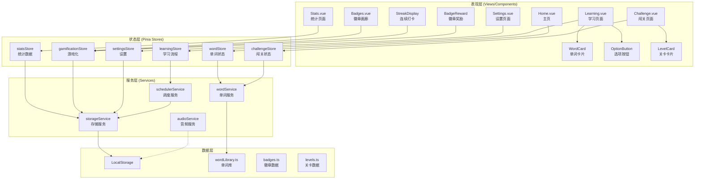

# Design Document - 百词斩式单词学习工具

## Overview

本项目采用**前后端分离架构**，前端使用 Vue 3 + TypeScript，后端使用 Node.js + Express + MySQL。

### 前端架构
- **表现层**: Vue 组件（页面视图、UI组件）
- **状态层**: Pinia Stores（全局状态管理）
- **服务层**: Services（API调用、业务逻辑）

### 后端架构
- **API层**: Express Routes（RESTful API）
- **服务层**: Services（业务逻辑）
- **数据层**: MySQL（数据存储）+ TypeORM（ORM）

## Steering Document Alignment

### Technical Standards (tech.md)
**前端：**
- Vue 3 Composition API + `<script setup>` 语法
- TypeScript 5.x 全覆盖，目标 100% 类型安全
- Pinia 状态管理，替代 Vuex
- Vitest 单元测试，目标 100% 覆盖率

**后端：**
- Node.js 18+ LTS
- Express 4.x
- TypeORM + MySQL
- JWT 认证
- Jest 单元测试

### Project Structure (structure.md)

**前端项目结构：**
```
client/
├── src/
│   ├── assets/          # 静态资源
│   ├── components/      # UI组件（按功能分组）
│   ├── stores/          # Pinia 状态管理
│   ├── types/           # TypeScript 类型定义
│   ├── services/        # API 服务
│   ├── views/           # 页面视图
│   ├── router/          # 路由配置
│   └── main.ts          # 入口文件
```

**后端项目结构：**
```
server/
├── src/
│   ├── controllers/     # 控制器（处理请求）
│   ├── services/        # 业务逻辑
│   ├── entities/        # 数据库实体
│   ├── middlewares/     # 中间件
│   ├── routes/          # 路由定义
│   ├── utils/           # 工具函数
│   └── app.ts           # 应用入口
├── tests/               # 测试文件
└── package.json
```

## Code Reuse Analysis

### Existing Components to Leverage
本项目从零开始构建，无现有组件可复用。但将遵循以下复用原则：
- **BaseButton**: 通用按钮组件，所有按钮统一使用
- **BaseCard**: 通用卡片组件，单词卡片和关卡卡片继承
- **Confetti**: 庆祝动画，徽章解锁和闯关成功复用

### Integration Points
- **API Service**: 前端通过 `apiService` 统一调用后端 API
- **JWT Auth**: 用户认证使用 JWT Token
- **LocalStorage**: 缓存用户数据和 Token

---

## Architecture

### 系统架构图



### Modular Design Principles
- **Single File Responsibility**: 每个文件处理一个特定关注点
- **Component Isolation**: 组件独立、可复用、可测试
- **Service Layer Separation**: 数据访问、业务逻辑、表现层分离
- **Utility Modularity**: 工具函数模块化，单一职责

---

## Components and Interfaces

### 学习模块组件

#### WordCard
- **Purpose:** 展示单词卡片（单词、音标、释义、例句）
- **Interfaces:**
  ```typescript
  interface WordCardProps {
    word: Word
    showAnswer: boolean
    mode: 'choice' | 'spelling'
  }
  interface WordCardEmits {
    (e: 'answer', correct: boolean): void
    (e: 'play-audio'): void
  }
  ```
- **Dependencies:** `audioService`, `Word` type
- **Reuses:** `BaseCard`, `BaseButton`

#### OptionButton
- **Purpose:** 选择题选项按钮，支持正确/错误动画
- **Interfaces:**
  ```typescript
  interface OptionButtonProps {
    option: string
    isCorrect: boolean | null
    isSelected: boolean
    disabled: boolean
  }
  ```
- **Dependencies:** None
- **Reuses:** `BaseButton`

#### TextInput
- **Purpose:** 拼写输入框，支持实时验证
- **Interfaces:**
  ```typescript
  interface TextInputProps {
    correctAnswer: string
    placeholder: string
  }
  interface TextInputEmits {
    (e: 'submit', answer: string): void
    (e: 'correct'): void
    (e: 'incorrect'): void
  }
  ```
- **Dependencies:** None
- **Reuses:** None

#### FeedbackAnimation
- **Purpose:** 正确/错误反馈动画
- **Interfaces:**
  ```typescript
  interface FeedbackAnimationProps {
    type: 'correct' | 'incorrect'
    duration: number
  }
  ```
- **Dependencies:** None
- **Reuses:** None

### 游戏化组件

#### StreakDisplay
- **Purpose:** 显示连续打卡天数和火焰动画
- **Interfaces:**
  ```typescript
  interface StreakDisplayProps {
    streak: number
    showAnimation: boolean
  }
  ```
- **Dependencies:** `gamificationStore`
- **Reuses:** None

#### BadgeReward
- **Purpose:** 徽章解锁弹窗，显示徽章详情和解锁动画
- **Interfaces:**
  ```typescript
  interface BadgeRewardProps {
    badge: Badge
    visible: boolean
  }
  interface BadgeRewardEmits {
    (e: 'close'): void
  }
  ```
- **Dependencies:** None
- **Reuses:** `Confetti`

#### LevelProgress
- **Purpose:** 用户段位进度条
- **Interfaces:**
  ```typescript
  interface LevelProgressProps {
    currentLevel: number
    xp: number
    xpToNext: number
  }
  ```
- **Dependencies:** `gamificationStore`
- **Reuses:** None

### 闯关组件

#### LevelCard
- **Purpose:** 关卡卡片，显示关卡信息和状态
- **Interfaces:**
  ```typescript
  interface LevelCardProps {
    level: ChallengeLevel
    isUnlocked: boolean
    starRating: 0 | 1 | 2 | 3
  }
  interface LevelCardEmits {
    (e: 'select', levelId: string): void
  }
  ```
- **Dependencies:** None
- **Reuses:** `BaseCard`

#### TimerDisplay
- **Purpose:** 倒计时显示，支持警告状态
- **Interfaces:**
  ```typescript
  interface TimerDisplayProps {
    seconds: number
    isWarning: boolean
  }
  ```
- **Dependencies:** None
- **Reuses:** None

#### ChallengeResult
- **Purpose:** 闯关结果展示（成功/失败、星级、奖励）
- **Interfaces:**
  ```typescript
  interface ChallengeResultProps {
    isPassed: boolean
    starRating: 0 | 1 | 2 | 3
    correctCount: number
    wrongCount: number
    xpEarned: number
  }
  interface ChallengeResultEmits {
    (e: 'retry'): void
    (e: 'exit'): void
  }
  ```
- **Dependencies:** None
- **Reuses:** `Confetti`

### 统计组件

#### DailyStats
- **Purpose:** 每日学习统计卡片
- **Interfaces:**
  ```typescript
  interface DailyStatsProps {
    newWords: number
    reviewWords: number
    correctRate: number
  }
  ```
- **Dependencies:** `statsStore`
- **Reuses:** `BaseCard`

#### CheckInCalendar
- **Purpose:** 打卡日历，标记每日打卡状态
- **Interfaces:**
  ```typescript
  interface CheckInCalendarProps {
    year: number
    month: number
    checkInDates: Date[]
  }
  ```
- **Dependencies:** None
- **Reuses:** None

#### AccuracyGauge
- **Purpose:** 正确率仪表盘
- **Interfaces:**
  ```typescript
  interface AccuracyGaugeProps {
    accuracy: number
  }
  ```
- **Dependencies:** None
- **Reuses:** None

---

## Data Models

### Word（单词）
```typescript
interface Word {
  id: string                    // 唯一标识
  word: string                  // 单词
  phonetic: string              // 音标
  pronunciation: string         // 发音音频URL
  meanings: Meaning[]           // 释义列表
  examples: Example[]           // 例句列表
  image?: string                // 关联图片URL
  category?: string             // 分类标签
  difficulty: 1 | 2 | 3 | 4 | 5 // 难度等级
}

interface Meaning {
  partOfSpeech: string          // 词性
  definition: string            // 定义
  translation: string           // 中文翻译
}

interface Example {
  sentence: string              // 英文例句
  translation: string           // 中文翻译
}
```

### LearningRecord（学习记录）
```typescript
interface LearningRecord {
  id: string
  wordId: string
  status: 'new' | 'learning' | 'reviewing' | 'mastered'
  masteryLevel: 0 | 1 | 2 | 3 | 4 | 5  // 掌握度
  correctCount: number
  wrongCount: number
  nextReviewAt: Date            // 下次复习时间
  lastReviewAt: Date            // 上次复习时间
  createdAt: Date
}
```

### UserStats（用户统计）
```typescript
interface UserStats {
  totalDays: number             // 累计学习天数
  totalWords: number            // 总学习词汇数
  masteredWords: number         // 已掌握词汇数
  correctRate: number           // 总体正确率
  streak: number                // 连续打卡天数
  todayStats: DailyStats
  checkInCalendar: CheckInRecord[]
}

interface DailyStats {
  date: Date
  newWordsCount: number
  reviewWordsCount: number
  correctCount: number
  wrongCount: number
  correctRate: number
  isCompleted: boolean
}

interface CheckInRecord {
  date: Date
  isCheckIn: boolean
}
```

### Badge（徽章）
```typescript
interface Badge {
  id: string
  name: string
  icon: string                  // 徽章图标
  description: string
  rarity: 'common' | 'rare' | 'epic' | 'legendary'
  unlockCondition: {
    type: 'streak' | 'words' | 'accuracy' | 'challenge'
    value: number
  }
  isUnlocked: boolean
  unlockedAt?: Date
}
```

### UserLevel（用户段位）
```typescript
interface UserLevel {
  currentLevel: number          // 当前等级
  currentTitle: string          // 当前称号
  xp: number                    // 经验值
  xpToNext: number              // 下一级所需经验
  levelProgress: number         // 进度百分比
}

// 称号对应表
const LEVEL_TITLES: Record<number, string> = {
  1: '初学者',
  5: '学徒',
  10: '学习者',
  15: '勤奋者',
  20: '单词达人',
  30: '单词大师',
  50: '传奇人物',
  100: '词汇之神'
}
```

### ChallengeLevel（关卡）
```typescript
interface ChallengeLevel {
  id: string
  name: string
  description: string
  wordCount: number
  timeLimit?: number            // 秒数，无限制则 undefined
  maxErrors: number
  difficulty: 'easy' | 'medium' | 'hard' | 'extreme'
  starRating: 0 | 1 | 2 | 3
  isUnlocked: boolean
  requiredLevel?: number        // 解锁所需等级
  xpReward: number              // 完成奖励经验
}
```

### ChallengeSession（闯关会话）
```typescript
interface ChallengeSession {
  levelId: string
  wordIds: string[]
  currentIndex: number
  startTime: Date
  endTime?: Date
  correctCount: number
  wrongCount: number
  timeRemaining?: number
  isCompleted: boolean
  isFailed: boolean
}
```

### UserSettings（用户设置）
```typescript
interface UserSettings {
  dailyNewWords: number         // 每日新词数量
  learningMode: 'choice' | 'spelling' | 'mixed'
  soundEnabled: boolean
  autoPlayAudio: boolean
  theme: 'light' | 'dark' | 'auto'
}
```

---

## Error Handling

### Error Scenarios

1. **LocalStorage 不可用**
   - **Handling:** 检测 LocalStorage 可用性，不可用时使用内存存储并提示用户
   - **User Impact:** 显示警告提示"数据将不会保存，请启用浏览器存储"

2. **音频加载失败**
   - **Handling:** 捕获音频加载错误，静默失败并显示文字提示
   - **User Impact:** 单词发音按钮显示禁用状态

3. **单词库数据损坏**
   - **Handling:** 验证数据完整性，损坏时使用内置默认数据
   - **User Impact:** 显示提示"数据已重置"

4. **闯关超时**
   - **Handling:** 倒计时结束自动提交当前状态
   - **User Impact:** 显示时间到提示和结果页面

5. **网络离线**
   - **Handling:** 检测网络状态，离线时禁用需要网络的功能
   - **User Impact:** 显示离线提示，核心学习功能仍可用

---

## Testing Strategy

### Unit Testing
- **测试框架:** Vitest + Vue Test Utils
- **覆盖率目标:** 100%

**关键组件测试：**
- `WordCard`: 渲染测试、事件触发、props 变化
- `OptionButton`: 点击事件、动画状态、禁用状态
- `TextInput`: 输入验证、提交事件、正确/错误反馈
- `TimerDisplay`: 倒计时逻辑、警告状态

**关键 Store 测试：**
- `wordStore`: 状态变更、actions、getters
- `learningStore`: 学习流程、记录保存
- `gamificationStore`: 徽章解锁逻辑、经验计算

**关键 Service 测试：**
- `schedulerService`: 艾宾浩斯算法正确性
- `storageService`: 读写操作、错误处理
- `wordService`: 单词获取、随机选项生成

### Integration Testing
- **测试框架:** Vitest + @vue/test-utils

**关键流程测试：**
- 完整学习流程：开始 → 答题 → 反馈 → 下一个
- 打卡流程：学习完成 → 更新统计 → 检查徽章 → 显示奖励
- 闯关流程：选择关卡 → 答题 → 计时 → 结果

### End-to-End Testing
- **测试框架:** Playwright / Cypress

**用户场景测试：**
- 新用户首次使用：进入主页 → 开始学习 → 完成首日任务
- 连续打卡：模拟多日学习 → 验证徽章解锁
- 闯关挑战：进入闯关 → 完成关卡 → 验证解锁下一关
- 设置变更：修改设置 → 验证保存 → 重启验证持久化